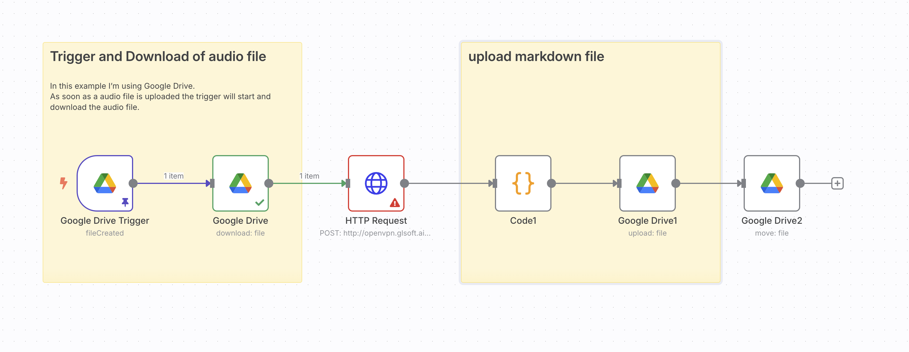

# 📁 Markitdown for GDrive

## 📌 專案簡介（繁體中文）

本專案是使用 [n8n](https://n8n.io) 所設計的自動化工作流程，目的是：

1. 自動偵測 Google Drive 指定資料夾中新上傳的檔案（例如 mp3、pdf、docx...）。
2. 將檔案下載後，透過 API 傳送到 Markdown 轉換服務。
3. 將轉換後的 `.md` 檔案重新上傳到指定的 Google Drive 資料夾。
4. 最後，將原始檔案移動至「完成」資料夾歸檔。

📂 相關資料夾：

- `n8n`：原始資料來源（監控上傳）
- `n8n-out`：轉換後的 Markdown 檔案儲存位置
- `n8n-done`：原始檔案移動歸檔位置

📤 呼叫的 API 格式如下：

POST http://openvpn.glsoft.ai:8000/convert
Content-Type: multipart/form-data
Body: file=<上傳的檔案>

📄 工作流程主要節點：

- Google Drive Trigger（觸發器）
- Google Drive（下載）
- HTTP Request（送出 API 請求）
- Code（將 API 回傳文字轉成 Markdown 檔案）
- Google Drive（上傳）
- Google Drive（移動）

---

## 🌐 Project Overview (English)

This project is an automation workflow built on [n8n](https://n8n.io), designed to:

1. Monitor a specific folder in Google Drive for newly uploaded files (e.g., mp3, pdf, docx, etc.).
2. Automatically download the uploaded file and send it to a Markdown-conversion API.
3. Upload the generated `.md` file to another designated Google Drive folder.
4. Archive the original file by moving it to a “done” folder.

📁 Folder structure:

- `n8n`: Source folder (monitored for new files)
- `n8n-out`: Destination folder for processed `.md` files
- `n8n-done`: Archive folder for original input files

📡 API Format:

POST http://openvpn.glsoft.ai:8000/convert
Content-Type: multipart/form-data
Body: file=

🔧 Key workflow components:

- Google Drive Trigger (watch for new files)
- Google Drive (download the file)
- HTTP Request (send file to conversion API)
- Code (generate `.md` file from API response)
- Google Drive (upload the markdown file)
- Google Drive (move the original file to archive)

---

🛠 若你想部署或調整本工作流，請先確認你已有以下條件：

- 一個啟用 OAuth 的 Google Drive 帳戶
- 一個可接收 multipart/form-data 並輸出 Markdown 的 API
- 正確設定的 n8n 執行環境（Docker / 本機 / 雲端皆可）

